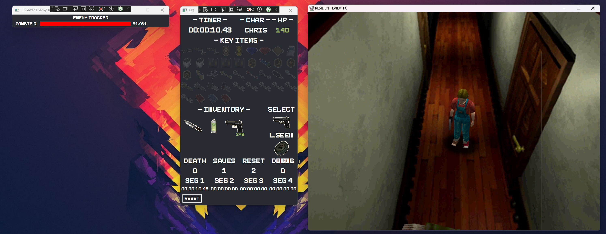
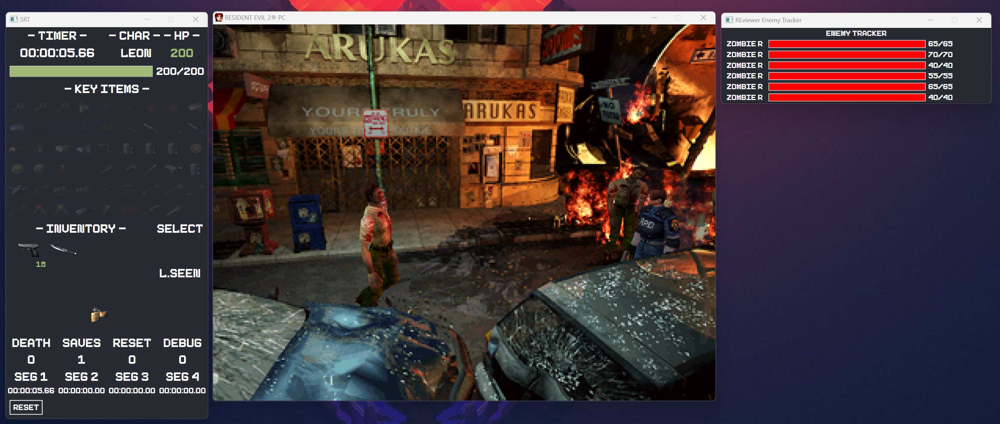
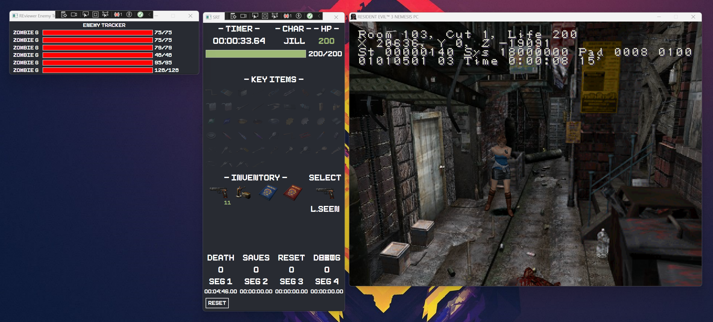

# REviewer (RE viewer)

REviewer is a SRT (Speedrun Tool) designed specifically for the OG (Original) versions of Resident Evil games, with a focus on compatibility with Biorand.

**Note: REviewer is currently in alpha stage and UNSTABLE. Use with caution.**

## Overview

## Details
| Game                | Platform | IGT | Enemy Tracker | Enemy Aiming | Partner | Inventory | Item Box | Save State | Key Items |
|---------------------|----------|-----|---------------|--------------|---------|-----------|----------|------------|-----------|
| RE1 Mediakit        |  PC      | X   | X             |              |         | X         | X        | X          |         X |
| RE2 SourceNext      |  PC      | X   | X             | X            | X       | X         | X        | X          | X         |
| RE2 Platinium (CHN) |  PC      | X   | X             | X            | X       | X         | X        | X          | X         |
| RE2 SourceNext      |  PC      | X   | X             | X            | X       | X         | X        | X          | X         |
| RE3 China           |  PC      |     | X             |              | X       | X         | X        | X          | X         |
| RE3 TWN             |  PC      | X   | X             |              | X       | X         | X        | X          | X         |
| RE3 Rebirth         |  PC      | X*  | X             | X            | X       | X         | X        | X          |         X |
| CVX PS2 US          |  PC      | X   |               |              | X       | X         | X        | X          |         X |

- There is no real time IGT in RE3 Rebirth, I have implemented an approximate one.
- On the other side, the final IGT will be alwys correct because i'm using the one that the game is using to give your final time.

### Resident Evil 1

### Resident Evil 2

### Resident Evil 3

REviewer provides a comprehensive set of features to enhance the speedrunning experience for Resident Evil games. It allows users to monitor various aspects of the game, including:

- Health status
- Character information
- Key items collected
- Inventory management
- Segment timers
- Selected item
- Last item seen

## Work In Progress

- [x] RE1 (Mediakit version) - 95% / Testing phase
- [X] RE2 (SourceNext) - 95% / Testing phase
- [X] RE3 (Rebirth) - 95% / Testing phase
- [X] RE3 (TWN) - 80% / Testing phase
- [X] RE3 (CHN) - 80% / Testing phase
- [X] CVX (PS2) - 80 % / Testing phase

Possible other port

- PSX Emulation games

## Accepted Process Nameso

### Resident Evil 2 - Source Next
- bio2
- Bio2
- Bio2 1.10
- bio2 1.10
- bio2 1.1
- bio2 v1.1
- Biohazard 2
- biohazard 2
- BIO2The City of Despair
- Leon And Claier
- bunny
- bunny2
- perro2
- re2mm
- Resident Evil 2.5 Dark Legacy
- RE2MM
- REVisited
- toos_ver2_0_0
- toos(hard)_ver2_0_0
- UEv3

### Resident Evil 2 - Platinum (CHN) - Claire
- CLAIRE

### Resident Evil 2 - Platinum (CHN) - Leon
- leon
- Irregular1.8
- Irregular
- Irregular2
- Irregular2.0

### Resident Evil 3 - Rebirth/Sourcenext
- BIOHAZARD(R) 3 PC
- biohazard(r) 3 pc
- The Lord of the Necropolis_1_1_0
- (English)The Lord of the Necropolis_1_1_0
- Nemesis Scenario

### Resident Evil 3 - CHN/TWN
- bio
- Bio
- Bio3
- bio3
- bio3_pc
- Bio3_PC_Mercenaries
- KeTu-FE3
- Silent Hill P.T
- Other Platforms

### Resident Evil - Code Veronica X - PS2 US
- pcsx2
- pcsx2-qt
- pcsx2-qtx64
- pcsx2-qtx64-avx2
- pcsx2x64
- pcsx2x64-avx2

## Known Bugs

- Enemy Tracker is not super stable in some cases.
- Save/Load State are still not totally working
- If you are confronted to a game that is not recognized but everything is green, close and re-run it.

## Features

### Health Monitoring

REviewer provides real-time monitoring of the player's health status. It displays the current health level and any changes that occur during gameplay.

#### What is the health status color system?

- Green: Fine
- Yellow: Light Caution
- Orange: Caution
- Red: Danger

### Character Information

The tool allows users to track important information about the character they are controlling. This includes attributes such as health, stamina, and other relevant stats.

### Key Item Tracking

REviewer keeps track of the key items collected by the player. It provides a visual representation of the items obtained and their current status.

### Inventory Management

The tool offers an inventory management system that helps players keep track of their items and optimize their inventory space.

### Segment Timers

REviewer includes segment timers to help speedrunners track their progress and optimize their route.

### Selected Item

The tool displays the currently selected item, making it easier for players to keep track of the item they are currently using.

### Last Item Seen

REviewer remembers the last item seen by the player, allowing them to quickly reference it when needed.

## Usage

To start using REviewer, follow these steps:

1. Download and install the tool. 
2. Open REviewer
3. Edit -> Settings -> Save the save repository path of your game (usually /savedata)
4. Select the appropriate game version.
5. Launch your game
6. Enjoy your speedrunning experience!

## FAQ

### How works Timers?

they are 5 timers in this tool, the first 4 are the segment timers, and the last one is the total time. The segment timers are used to measure the time of each segment of the game, and the total time is used to measure the time of the entire game. The segment timers are reset when the game is reset, and the total time is reset when the game is closed.

It's possible that you have only 1 segment timer, in this case, the segment timer will be the total time.

### What means the color background behind the key items?

- Green: The item is in the inventory/Item Box, or it has been used
- Orange: The item has been seen but is not in the inventory

## Contributing

I welcome contributions from the community to improve REviewer. If you have any suggestions, bug reports, or feature requests, please submit them through the official GitHub repository or Discord.

## License

REviewer is released under the [MIT License](https://opensource.org/licenses/MIT). Please refer to the LICENSE file for more details.

## Acknowledgements

I would like to thank the following individuals and projects for their contributions to REviewer:

- Biorand - for their support and collaboration.
- Resident Evil speedrunning community - for their valuable feedback and testing.
