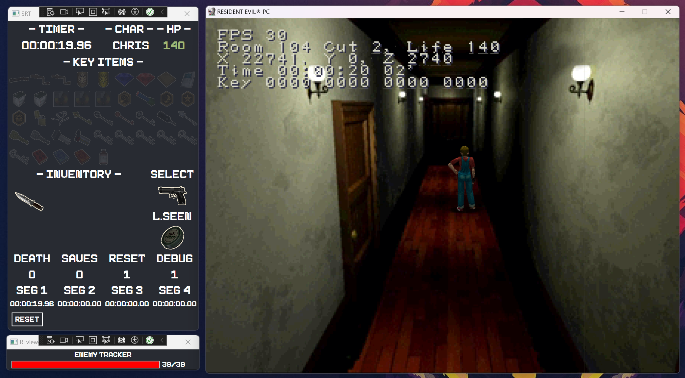

# REviewer (RE viewer)

REviewer is a SRT (Speedrun Tool) designed specifically for the OG (Original) versions of Resident Evil games, with a focus on compatibility with Biorand.

**Note: REviewer is currently in alpha stage and EXTREMELY UNSTABLE. Use with caution.**

## Overview

REviewer provides a comprehensive set of features to enhance the speedrunning experience for Resident Evil games. It allows users to monitor various aspects of the game, including:

- Health status
- Character information
- Key items collected
- Inventory management
- Segment timers
- Selected item
- Last item seen

## Work In Progress

- [x] RE1 (Mediakit version) [60%]
- [ ] RE2 (SourceNext)
- [ ] RE3 (SourceNext)
- [ ] CVX (PS2)

## Known Bugs

- No load/save state working yet
- Duplicate items are not working properly
- And maybe more...

## Features

### Health Monitoring

REviewer provides real-time monitoring of the player's health status. It displays the current health level and any changes that occur during gameplay.

#### What is the health status color system?

- Blue: Full Health
- Green: Fine
- Yellow: Light Caution
- Orange: Caution
- Red: Danger

### Character Information

The tool allows users to track important information about the character they are controlling. This includes attributes such as health, stamina, and other relevant stats.

### Key Item Tracking

REviewer keeps track of the key items collected by the player. It provides a visual representation of the items obtained and their current status.

### Inventory Management

The tool offers an inventory management system that helps players keep track of their items and optimize their inventory space.

### Segment Timers

REviewer includes segment timers to help speedrunners track their progress and optimize their route.

### Selected Item

The tool displays the currently selected item, making it easier for players to keep track of the item they are currently using.

### Last Item Seen

REviewer remembers the last item seen by the player, allowing them to quickly reference it when needed.

## Usage

To start using REviewer, follow these steps:

1. Download and install the tool. 
2. Launch the Resident Evil game you want to speedrun.
3. Open REviewer
4. Edit -> Settings -> Save the save repository path of your game (usually /savedata)
5. Select the appropriate game version.
6. Click the "Check" button to ensure that the game is running properly.
7. Enjoy your speedrunning experience!

## FAQ

### How works Timers?

they are 5 timers in this tool, the first 4 are the segment timers, and the last one is the total time. The segment timers are used to measure the time of each segment of the game, and the total time is used to measure the time of the entire game. The segment timers are reset when the game is reset, and the total time is reset when the game is closed.

It's possible that you have only 1 segment timer, in this case, the segment timer will be the total time.

### Wait I clicked on reset and all my inventory/item box are gone! What happened?

The reset button is used to reset the game state, so it will reset the inventory and item box. If you want to reset the game state without losing your inventory, you can use the "Reset" button in the game menu.

### My game save is crashing, what can I do?

REviewer is patching the game save to for instaurate the communication between the game and the tool, so it's possible that the game save is crashing. To fix this, you need to load the save with the tool.
If you want to play without the tool, you need to patch the save itself. I will implement a short tool to do this in the future.

### What means the color background behind the key items?

- Green: The item is in the inventory/Item Box, or it has been used
- Yellow: The item has been seen but is not in the inventory

## Contributing

I welcome contributions from the community to improve REviewer. If you have any suggestions, bug reports, or feature requests, please submit them through the official GitHub repository or Discord.

## License

REviewer is released under the [MIT License](https://opensource.org/licenses/MIT). Please refer to the LICENSE file for more details.

## Acknowledgements

I would like to thank the following individuals and projects for their contributions to REviewer:

- Biorand - for their support and collaboration.
- Resident Evil speedrunning community - for their valuable feedback and testing.
